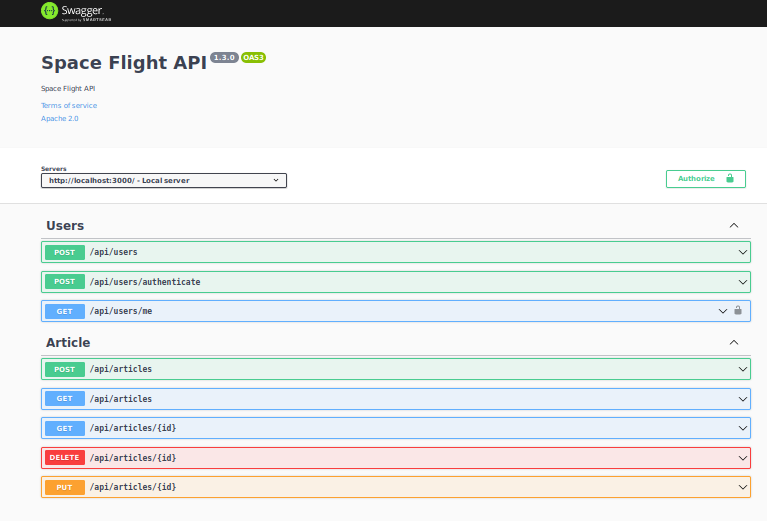

<h2 align="center">

</h2>

  
  

 <a href="#sobre">Sobre</a> •
 <a href="#demonstracao">Demonstração</a> •
 <a href="#tecnologias">Tecnologias</a> •
 <a href="#instalacao">Instalação</a> •
 <a href="#docker">Docker</a> •
 <a href="#autor">Autor</a>

<h1 style="text-align: center;margin-top:50px;margin-bottom:50px">Bem Vindo ao SpaceFlight API 🚀</h1>

## Projeto faz parte do desafio <a href="https://lab.coodesh.com/public-challenges/back-end-challenge-2021" target="_blank">coodesh</a> desenvolvido em NodeJS + SpaceFlight News API

https://coodesh-space.herokuapp.com/
 
 

## 🎨 Projeto 

 
 
Este projeto faz parte do Desafio Backend da empresa coodesh lab onde foi utilizado principios de Clean Code, TDD, Testes Unitarios e de Integração, GitHub Actions para tarefas de CI/CD com execução dos testes e ao final deploy automatizado para o Heroku garantindo assim maior confiabilidade pois o deploy só é realizado após os testes. Link do desafio: https://lab.coodesh.com/public-challenges/back-end-challenge-2021
 
 

## 💻 Demostração 

 
 
<h2 align="center">

</h2>

Documentação feita seguindo padrão OpenAPI utilizando o Swagger bastando acessar a seguinte url - https://coodesh-space.herokuapp.com/api/docs

## 🛠 Tecnologias 

Algumas das ferramentas utilizadas na construção do projeto:

- [Node.js](https://nodejs.org/pt-br/)
- [Express](https://expressjs.com/pt-br/)
- [OvernightJS](https://github.com/seanpmaxwell/overnight)
- [Typescript](https://www.typescriptlang.org/)
- [swagger-ui-express](https://github.com/scottie1984/swagger-ui-express)
- [MongoDB com Mongoose](https://mongoosejs.com/)
- [Mockingoose](https://github.com/alonronin/mockingoose)
- [Jest](https://jestjs.io/pt-BR/)
- [Supertest](https://github.com/visionmedia/supertest)
- [mongodb-memory-server](https://github.com/nodkz/mongodb-memory-server)
- [http-status-codes](https://github.com/prettymuchbryce/http-status-codes)

## 📝 Instruções de Instalação 

1. Clone o repositorio

[`https://github.com/marcusjava/avonale-tmdb`](https://github.com/marcusjava/coodesh_backendv2.git)

2. Instalação
   Pré-requisitos: NodeJS instalado https://nodejs.org/en/

- Instalar dependencias - `yarn install`
- MongoDB instalado localment ou banco na nuvem Ex: https://www.mongodb.com/atlas/database
- Configurar o arquivo config/default.json com as informações do banco de dados(String de conexão)
- Iniciar projeto - `yarn start:local`

### Usando Docker 

- Construir imagem: docker build -t nome . no diretorio do dockerfile
- Testando imagem: docker run -p 80:80 noma_imagem
- Abra o navegador e digite http://localhost

## 👨‍💻 Autor 

<a href="https://github.com/marcusjava" style="text-decoration: none;">

 Feito com ❤️ por Marcus Vinicius 👋 Entre em contato!  
</a>
